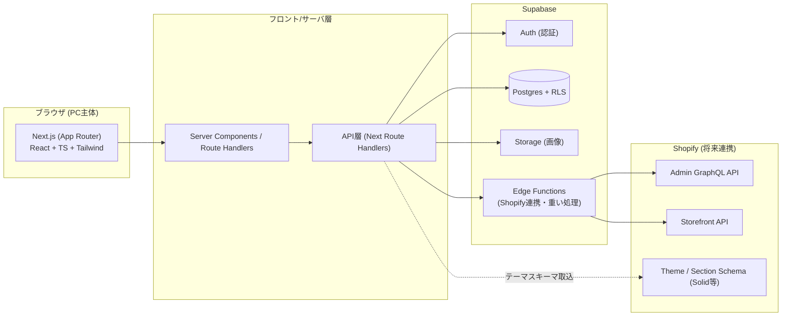
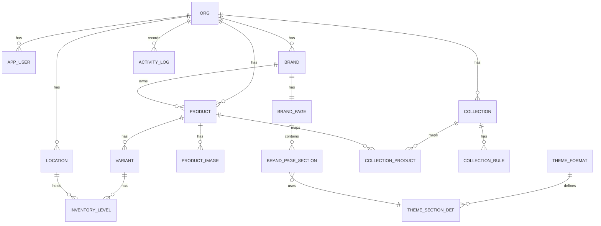
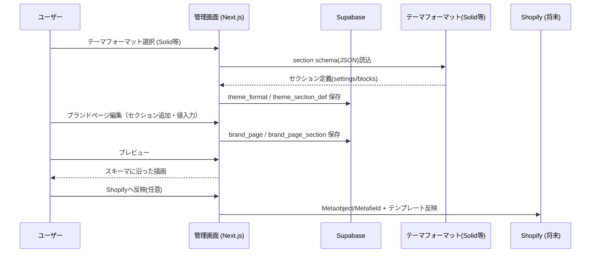
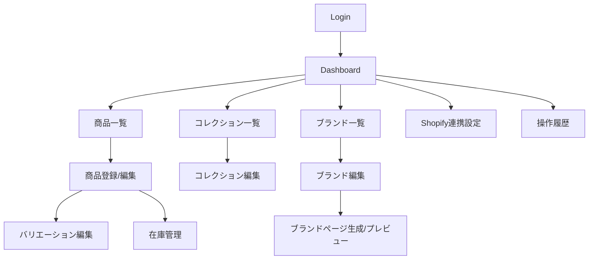

# Shopify練習アプリ 基本設計書

- バージョン: 1.0
- 作成日: 2026-06-07
- 前提資料: 「Shopify練習アプリ 要件定義書」
- 技術スタック: Supabase（DB/Auth/Storage） + Next.js（App Router） + React + TypeScript + Tailwind CSS

---

## 1. 目的

要件定義書をベースに、アパレル職種向けのShopify管理画面（練習アプリ）の
システム全体構成・機能配置・データ構造・画面構成・外部連携方針を定義する。

特に以下を実現する。

- 商品登録 / バリエーション（サイズ・カラー） / 在庫管理
- コレクション管理（手動・自動簡易ルール）
- ブランドマスタ管理
- ブランドページ生成（Shopifyのブランドページフォーマット = テーマのセクションスキーマを読み込んで生成）

---

## 2. システム全体構成

### 2.1 構成概要



### 2.2 レイヤ責務

| レイヤ | 技術 | 責務 |
|---|---|---|
| プレゼンテーション | Next.js / React / Tailwind | 画面表示、入力、プレビュー描画 |
| アプリケーション | Next Route Handlers / Server Actions | 入力検証、業務ロジック、権限制御 |
| データ | Supabase Postgres + RLS | 永続化、テナント/権限分離 |
| 認証 | Supabase Auth | ログイン、セッション、ロール |
| ストレージ | Supabase Storage | 商品画像、ブランド画像 |
| 連携 | Supabase Edge Functions | Shopify Admin/Storefront API同期 |

---

## 3. 技術選定方針

### 3.1 フロントエンド
- Next.js App Router（Server Components中心、データ取得はサーバ側）
- 認証/権限が絡む更新は Server Actions もしくは Route Handlers 経由
- UIは Tailwind CSS。共通コンポーネントは shadcn/ui 系を想定
- フォームは React Hook Form + Zod（型と検証の単一化）
- 表・マトリクスUI（サイズ×カラー）はクライアントコンポーネントで実装

### 3.2 バックエンド/データ
- Supabase Postgres を主データストア
- Row Level Security (RLS) で組織・ユーザー単位のデータ分離
- 認証は Supabase Auth（@supabase/ssr でSSR対応）
- 画像は Supabase Storage（署名URL配信）

### 3.3 Shopify連携（将来）
- Shopify Admin GraphQL API: Product / Variant / Inventory / Collection / Metafield / Metaobject の作成・更新
- Storefront API: ブランドページのプレビューデータ取得
- 連携処理は Edge Functions に隔離（フロントに秘密情報を置かない）

---

## 4. 認証・権限設計（概要）

### 4.1 ロール

| ロール | 権限 |
|---|---|
| admin | 全機能。ユーザー管理、Shopify連携設定 |
| editor | 商品/在庫/コレクション/ブランド編集 |
| viewer | 閲覧のみ |

### 4.2 分離方針
- 全業務テーブルに `org_id` を付与
- RLS で「自分の所属orgのデータのみ」アクセス許可
- 練習アプリのため org = 学習グループ/個人として運用可能

---

## 5. 機能構成（機能一覧）

| No | 機能 | 区分 | 概要 |
|---|---|---|---|
| F-01 | 認証 | 共通 | ログイン/ログアウト/セッション |
| F-02 | ダッシュボード | 共通 | 件数サマリ、在庫アラート |
| F-03 | 商品一覧 | 商品 | 検索/絞り込み/一覧 |
| F-04 | 商品登録・編集 | 商品 | 基本情報・画像・タグ |
| F-05 | バリエーション編集 | 商品 | サイズ×カラー、SKU自動採番 |
| F-06 | 在庫管理 | 在庫 | SKU別在庫、ロケーション別 |
| F-07 | 在庫アラート | 在庫 | 在庫切れ/在庫少 |
| F-08 | コレクション一覧 | コレクション | 一覧/件数/公開状態 |
| F-09 | コレクション編集 | コレクション | 手動追加、自動ルール |
| F-10 | ブランド一覧 | ブランド | 一覧/公開状態/表示順 |
| F-11 | ブランド編集 | ブランド | マスタ情報、ページコンテンツ |
| F-12 | ブランドページ生成 | ブランド | テーマスキーマ読込→ページ構成生成→プレビュー |
| F-13 | Shopify連携設定 | 連携 | ストア接続、同期 |
| F-14 | 操作履歴 | 共通 | 監査ログ |
| F-15 | 学習ガイド | 学習 | 用語/チュートリアル |

---

## 6. データ設計（論理）

### 6.1 ER図



### 6.2 主要エンティティ

| エンティティ | 役割 |
|---|---|
| org | テナント（学習グループ/個人） |
| app_user | ユーザー・ロール |
| brand | ブランドマスタ |
| brand_page | ブランドページ本体（1ブランド1ページ） |
| brand_page_section | ブランドページを構成するセクション群 |
| theme_format | 読み込んだShopifyテーマフォーマット（例: Solid） |
| theme_section_def | テーマのセクション定義（schemaから抽出） |
| product | 商品（親） |
| variant | バリエーション（サイズ×カラー、SKU） |
| product_image | 商品画像 |
| collection | コレクション |
| collection_product | 手動コレクションの所属 |
| collection_rule | 自動コレクションの条件 |
| location | 在庫ロケーション |
| inventory_level | バリエーション×ロケーションの在庫 |
| activity_log | 操作履歴 |

---

## 7. ブランドページ生成の基本方針（重要）

### 7.1 背景（Shopify仕様の前提）
Shopifyではブランド専用ページを以下で表現するのが一般的。

- テーマ（Solid等）が持つ **セクション(section)** = 表示部品。各セクションは **schema(JSON)** を持ち、設定可能フィールド（settings/blocks）を定義する。
- ブランドのような構造化データは **Metaobject** として保持し、**metaobject template**（JSONテンプレート）でページ化、もしくは **Storefront API / Liquid** で描画する。

したがって本アプリは「テーマのセクションスキーマを取り込み、それに合わせてブランドデータをマッピングし、Shopifyへ注入できるページ構成を作る」方式とする。

### 7.2 生成フロー



### 7.3 「フォーマット読み込み」の入力源
以下のいずれかからセクション定義(JSON schema)を取り込む。

1. テーマのセクションファイル（`sections/*.liquid` 内の `` JSON）を貼り付け/アップロード
2. 既定プリセット（Solid等の代表セクション定義を内蔵JSONとして同梱）
3. 将来: Shopify Admin APIからテーマアセット取得

> 取り込んだschemaの `settings`（type, id, label等）を解析し、編集フォームを自動生成する（スキーマ駆動UI）。

### 7.4 マッピング方針
- テーマセクションの各 setting（例: heading, image_picker, richtext, color）に対して、ブランドデータ項目を割り当てる。
- 描画時はブランドデータ → セクション設定値 → プレビューHTML の順で展開。
- Shopify反映時はブランドデータを Metaobject フィールド / セクション設定にマッピングして注入。

---

## 8. 画面構成（基本）

### 8.1 画面遷移



### 8.2 レイアウト方針
- 左サイドナビ + メインコンテンツの管理画面レイアウト
- 商品/在庫は表中心。サイズ×カラーはマトリクス入力
- ブランドページ編集は「左:セクション/設定」「右:プレビュー」の2ペイン

---

## 9. 非機能（基本）

| 項目 | 方針 |
|---|---|
| 性能 | 一覧表示3秒以内、保存2秒以内（要件準拠） |
| セキュリティ | Supabase Auth + RLS、Shopify秘密情報はEdgeのみ |
| 監査 | activity_log に主要操作記録 |
| 可用性 | 学習用途。平日日中の安定稼働 |
| 保守性 | 連携層を分離、スキーマ駆動でUI拡張容易 |

---

## 10. ディレクトリ構成（基本）

```
app/
  (auth)/login/
  (dashboard)/
    page.tsx               # ダッシュボード
    products/
    collections/
    brands/
      [id]/page/           # ブランドページ生成
    settings/
    logs/
  api/                     # Route Handlers (BFF)
components/
  ui/                      # 共通UI
  products/
  brands/
  brand-page/              # スキーマ駆動レンダラ
lib/
  supabase/                # client/server/admin
  shopify/                 # Admin/Storefront client (Edge)
  schema/                  # zod schema
  theme/                   # section schema parser
supabase/
  migrations/
  functions/               # edge functions
types/
```

---

## 11. 次工程
本書をもとに詳細設計書（テーブル定義・API仕様・画面項目・スキーマ駆動レンダラ仕様）を作成する。
